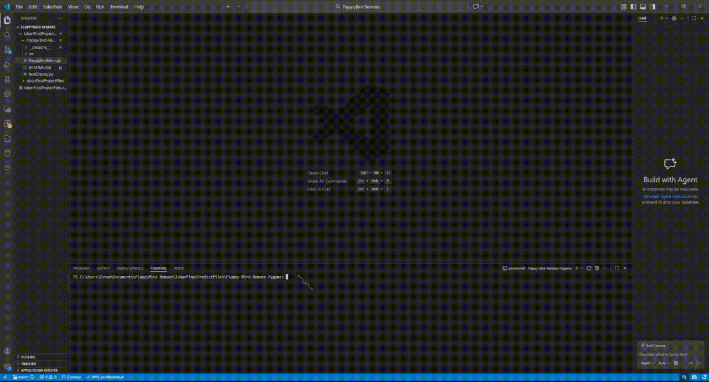

# Flappy Bird Remake (Pygame)

This is a remake of the iconic game Flappy Bird built using Python and Pygame.
This project includes multiple difficulty modes, bird color selection, sound effects, background music, pause functionality, a complete menu system, and more.

Created by: Ishan Lakhotia

---
# Game Overview

This is a recreation of the classic Flappy Bird game where the player controls a bird and must navigate through randomly generated pipes without crashing.

The goal is to survive as long as possible and achieve the highest score.

---

# Cloning Repo/Setup/Running Game

## Requirements

- Must have a Python 3.x version

- Must have Pygame

## Cloning Repo:
```bash
git clone https://github.com/SlyIshan27/Flappy-Bird-Remake-Pygame.git
cd Flappy-Bird-Remake-Pygame
```
## Setup:
```bash
pip install pygame
```
## Running the Game
```bash
python3 main.py
```
- A UI of the game will then pop-up

# Demo


---

## Features

### Three Difficulty Modes:

- Easy

- Medium

- Hard

### Bird Color Selection
- You can select a:
    - Red Bird
        
        or
    - Blue Bird

### Background Music

- Random music playback

- Mute / unmute at any time

### Sound Effects

- Wing flap

- Death sound

- Pause System

### Score & High Score Tracking

### Keyboard and Mouse Controls

### Instruction Screen

### Animated birds and moving ground

---
# Project Structure

| Component   | Description               |
| ----------- | ------------------------- |
| `flappyBirdMain.py` | Main Game Logic         |
| `textDisplay.py`    | Text Display and UI          |
| `src/`      | Folder for images, audio files, and fonts         |

---

# Code Explanation

This project is structured around functions, game states, and event-driven loops using Pygame.

## Core Functions:
- MusicPlayer() / MusicPlayerMuted()

    - Randomly selects background music from a list

    - Handles volume control based on mute state

- FlappyBirdRestart()

    - Resets important game variables such as:

        - Bird position

        - Pipe list

        - Score

        - Movement values

    - Used when switching modes or restarting the game

- spawnPipe()

    - Creates a pair of top and bottom pipes

    - Pipe heights are chosen randomly from preset lists

    - Pipes spawn off-screen to the right

    - pipeMovement() and pipeDrawing()

    - Moves pipes left across the screen

    - Draws flipped pipes for the top obstacles

- collisionFailure()

    - Detects collisions between:

    - Birds and pipes

    - Birds and ground

    - Birds flying too high

    - Plays death sound and ends the game when a collision occurs

## Bird Mechanics
Gravity & Movement

- Gravity is applied every frame to pull the bird down

- Pressing space or clicking applies upward velocity

rotateBird()

- Rotates the bird based on its vertical movement

- Creates a smoother and more realistic flying effect

## Bird Animation

- Bird flapping is handled using a timer (FlapSpeed)

- Cycles through three sprite images for animation

## Scoring System
- scoreCheck()

    - Increases score when the bird passes through a pipe

    - Uses pipe position and a flag to avoid double scoring

- HighScore()

    - Updates the high score when the player beats it

## Text & UI Handling (textDisplay.py)

- The TextDisplay class handles all text rendering, including:

    - Main menu text

    - Instructions screen

    - Bird color picker

    - Pause menu

- This keeps UI code separate from game logic, making the project cleaner and easier to manage.

## Game State Management

- The game uses boolean flags to control different states:

    - Main menu

    - Instructions

    - Bird picker

    - Each difficulty mode

    - Pause screens

- Each state runs in its own loop, ensuring:

    - Only one screen is active at a time

    - Inputs behave differently depending on context

### Pause System

- Pressing P pauses the game

- The current mode is saved

- Pressing C resumes gameplay

- Music controls remain available during pause

# Technologies Used

- Python

- Pygame

- Event-driven programming

- Sprite animation

- Sound & music handling

## Future Improvements

Future Improvements to the game and code will be added in the future to improve object-oriented design and game playability.